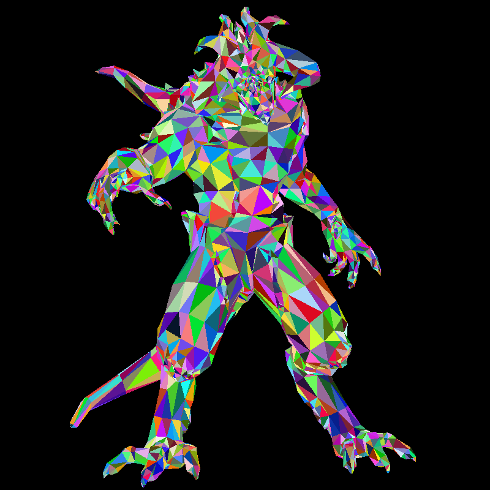
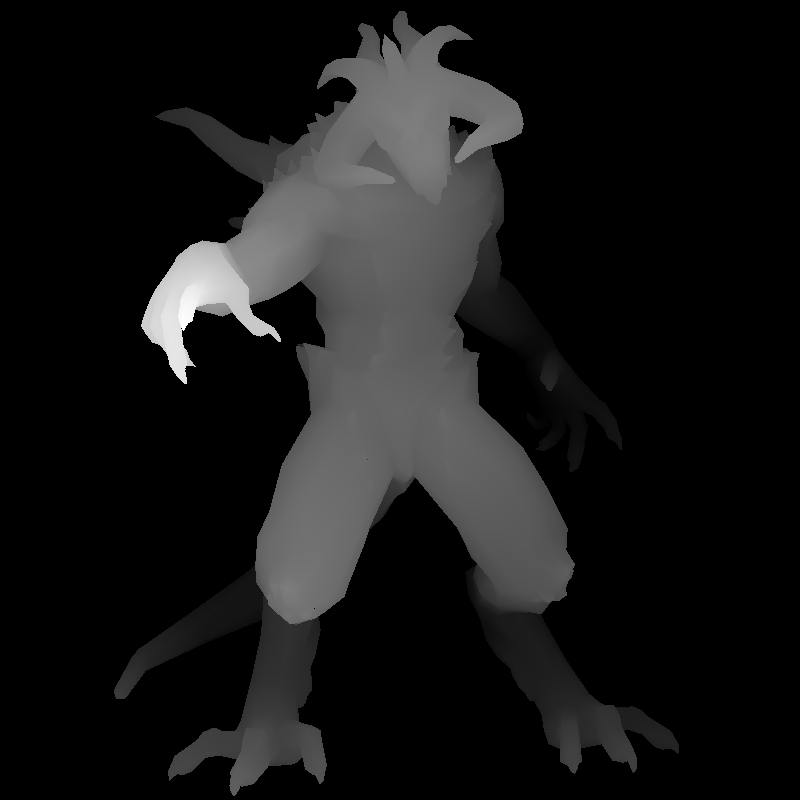

# softrasterizer

A software rasteriser in C++17 — no graphics API, no third-party libraries.
Loads a Wavefront OBJ, projects it through a perspective camera, and fills it
with a depth buffer, writing TGA images directly.

| Render | Depth buffer |
|---|---|
|  |  |

## Build

```sh
make        # build ./softrasterizer
make run    # render assets/model.obj
make view   # render, then open both images
make test   # build and run the test suite
```

`./softrasterizer [model.obj]` — defaults to `assets/model.obj`.

## Modules

| Module | Responsibility |
|---|---|
| `Vec3.h` | 3D vector, arithmetic, dot, cross, norm |
| `Matrix` | 4×4 transforms, composition, point/direction application |
| `Mesh` | OBJ parsing into indexed geometry |
| `Camera` | View and projection matrices |
| `Framebuffer` | Colour and depth buffers, TGA output |
| `Renderer` | Back-face culling, barycentric fill, depth test |

## Design notes

**Indexed geometry.** `Mesh` stores each vertex once and each face as three
indices. A vertex shared by several faces is not duplicated, and the faces
agree on which vertex they share — the prerequisite for smooth shading.

**Separate types per pipeline stage.** A `Face` holds indices into the mesh; a
`ScreenTriangle` holds projected pixel positions and depths. They are distinct
types because they hold different things, so a model-space point cannot reach
the rasteriser by accident.

**Coupled colour and depth.** `Framebuffer` exposes only `set_if_nearer`, which
writes both or neither. There is no way to update one without the other and
have them describe different triangles.

**Per-pixel visibility.** Depth is interpolated across each face from its
corners and compared per pixel, so draw order does not matter and triangles may
interpenetrate. Back-face culling remains as an optimisation, not a correctness
requirement.

## Tests

`make test` builds a single binary from `tests/` and runs it; a failing check
prints file and line and returns non-zero. Covers vector and matrix algebra,
OBJ parsing across all four face spellings, framebuffer bounds and depth
ordering, and rasteriser coverage, winding, and degenerate triangles.

## Status

Working: OBJ loading, perspective camera, back-face culling, z-buffered
rasterisation, TGA output.

Next: lighting, texture mapping, programmable shading.
